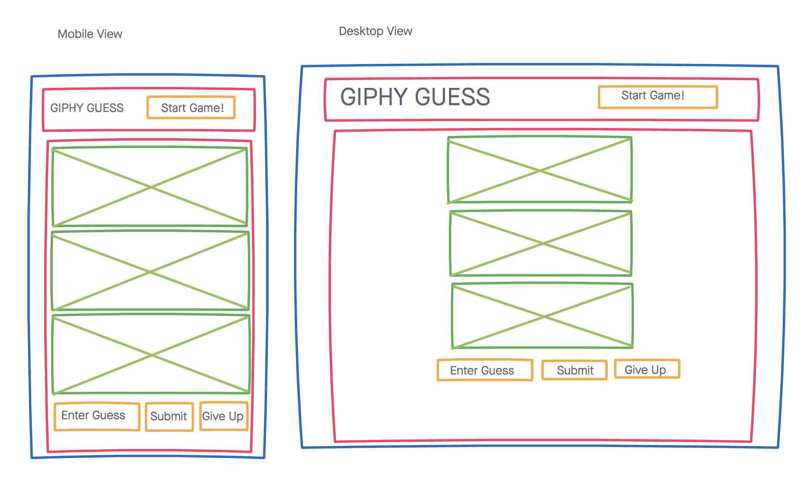
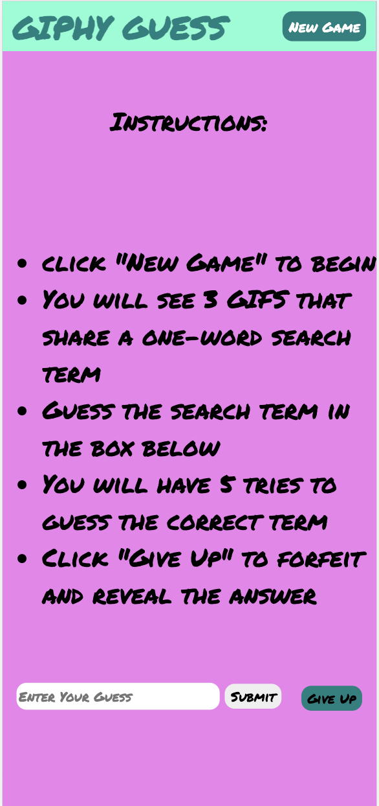
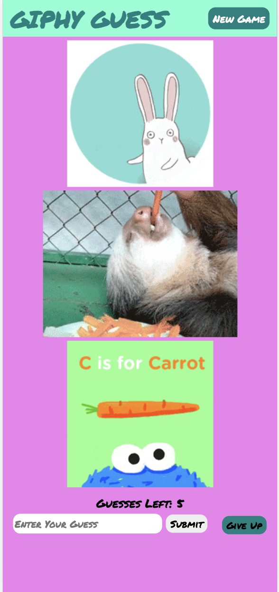

# Giphy Guess Game

Giphy Guess is a one-player game in which the user is presented with 3 GIFs that share a fun one-word search term. The user has 5 tries to guess the search term that would return each of the 3 GIFs. Get it right within 5 guesses - You win!

## Technologies Used:
* HTML
* CSS
* Javascript
* JQuery
* Google Fonts
* Giphy API

## Screenshots:
### Wireframes

### App Screenshots
#### Game instructions view

#### Game play view

## Getting Started:
[Click Here](project1-giphy-game.vercel.app) to see the deployed app.

## Future Enhancements:
* The ability to track and save longest win streak to local storage 

